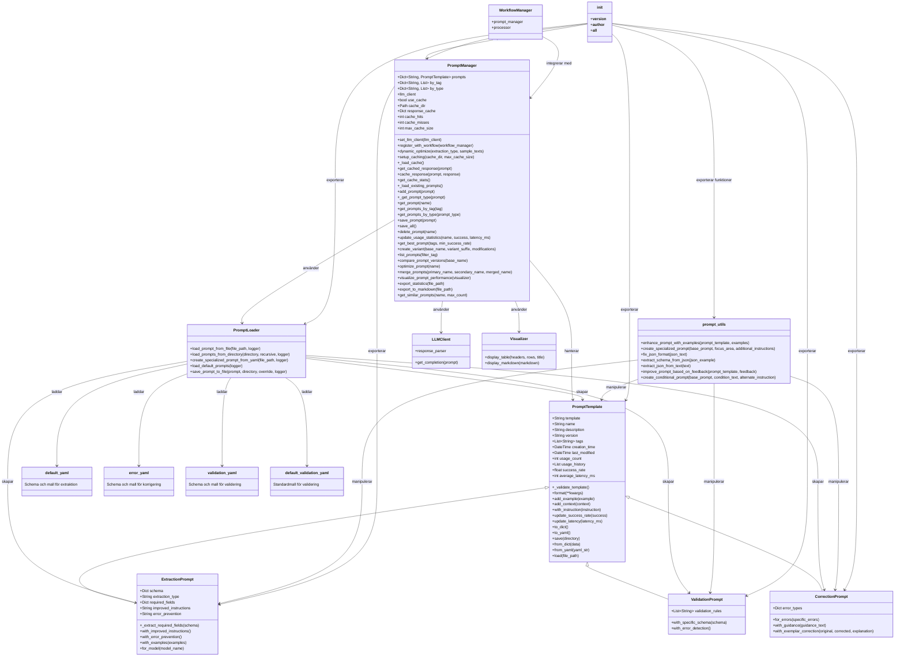

Jag ska skapa en detaljerad mermaid-diagram som visualiserar hur modulerna i "./prompts/" fungerar och är kopplade till varandra. Baserat på den kod du delat kan jag konstruera ett omfattande diagram som visar klassrelationer, arv, funktionsanrop och dataflöde.

För att göra diagrammet ännu tydligare, låt mig skapa en kompletterande diagram som fokuserar på dataflödet och processerna i systemet:

```mermaid
flowchart TD
    %% Huvudprocesser
    subgraph PromptManagement [Prompthantering]
        Load[Ladda Promptmallar]
        Create[Skapa Promptmallar]
        Modify[Modifiera Promptmallar]
        Use[Använda Promptmallar]
        Cache[Cacha Promptsvar]
        Optimize[Optimera Promptar]
        Export[Exportera Statistik]
    end

    %% Datakällor
    subgraph Storage [Lagring]
        YAML[YAML-filer]
        DefaultTemplates[Fördefinierade Mallar]
        CacheStorage[Cache-lagring]
    end

    %% Externa komponenter
    subgraph External [Externa System]
        LLM[LLM-klient]
        Workflow[Arbetsflödeshanterare]
        Logger[Logger]
        Vis[Visualizer]
    end

    %% Prompt-typer
    subgraph PromptTypes [Prompt-typer]
        Basic[Bas PromptTemplate]
        Extract[ExtractionPrompt]
        Validate[ValidationPrompt]
        Correct[CorrectionPrompt]
    end
    
    %% Utils
    subgraph Utils [Hjälpfunktioner]
        EnhanceExamples[enhance_prompt_with_examples]
        CreateSpecialized[create_specialized_prompt]
        FixJSON[fix_json_format]
        ExtractSchema[extract_schema_from_json]
        ExtractJSON[extract_json_from_text]
        ImproveFeedback[improve_prompt_based_on_feedback]
        CreateConditional[create_conditional_prompt]
    end

    %% Processer och dataflöden för laddning
    YAML --> Load
    DefaultTemplates --> Load
    Load --> Create
    
    %% Skapande och modifiering av mallar
    Create --> Basic
    Create --> Extract
    Create --> Validate
    Create --> Correct
    Basic --> Modify
    Extract --> Modify
    Validate --> Modify
    Correct --> Modify
    
    %% Användning av mallar
    Basic --> Use
    Extract --> Use
    Validate --> Use
    Correct --> Use
    Use --> Cache
    Cache --> CacheStorage
    CacheStorage --> Cache
    
    %% Optimering
    Use --> Optimize
    Optimize --> Basic
    Optimize --> Extract
    Optimize --> Validate
    Optimize --> Correct
    
    %% Statistik och export
    Use --> Export
    Export --> YAML
    
    %% Externa integrationer
    LLM <--> Use
    Workflow <--> Use
    Logger --> Load
    Logger --> Use
    Logger --> Optimize
    Vis <--> Export
    
    %% Utils kopplingar
    EnhanceExamples --> Modify
    CreateSpecialized --> Modify
    FixJSON --> Use
    ExtractSchema --> Create
    ExtractJSON --> Use
    ImproveFeedback --> Optimize
    CreateConditional --> Modify

    %% Huvud dataflöden och processer
    subgraph MainFlow [Huvudflöde]
        direction LR
        Init[Initialisering] --> LoadPromptsFlow[Ladda Promptar]
        LoadPromptsFlow --> ConfigureFlow[Konfigurera Manager]
        ConfigureFlow --> UsePromptFlow[Använda Prompt]
        UsePromptFlow --> OptimizeFlow[Optimera Prompt]
        OptimizeFlow --> ExportFlow[Exportera Statistik]
    end
    
    %% Detaljerade processer
    subgraph DetailedFlow [Detaljerat flöde för en prompt]
        direction TB
        LoadTemplate[Ladda mall] --> FormatPrompt[Formatera prompt]
        FormatPrompt --> SendToLLM[Skicka till LLM]
        SendToLLM --> ValidateResponse[Validera svar]
        ValidateResponse --> CorrectErrors[Korrigera fel om nödvändigt]
        CorrectErrors --> UpdateStats[Uppdatera statistik]
    end

    MainFlow -.-> PromptManagement
    DetailedFlow -.-> Use

```

